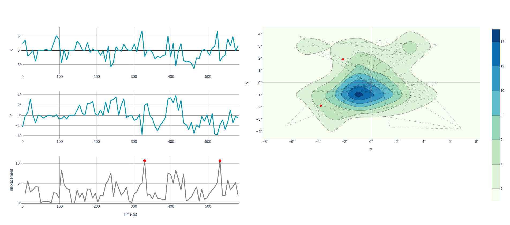

[](https://github.com/cpp-lln-lab/bidsMReye/actions/workflows/system_tests.yml)
[](https://github.com/cpp-lln-lab/bidsMReye/actions/workflows/test_and_coverage.yml)
[](https://codecov.io/gh/cpp-lln-lab/bidsMReye)
[](https://bidsmreye.readthedocs.io/en/latest/?badge=latest)
[](./LICENSE)

[](#contributors)
[](https://doi.org/10.1038/s41593-021-00947-w)

# bidsMReye

BIDS app for decoding gaze position from the eyeball MR-signal using
[deepMReye](https://github.com/DeepMReye/DeepMReye)
([1](https://doi.org/10.1038/s41593-021-00947-w)).

To be used on preprocessed BIDS derivatives (e.g.
[fMRIprep](https://github.com/nipreps/fmriprep) outputs).
No eye-tracking data required.

By default, bidsMReye uses a [pre-trained version](https://osf.io/mrhk9/) of
[deepMReye](https://github.com/DeepMReye/DeepMReye) trained on 5 datasets incl.
guided fixations ([2](https://doi.org/10.1038/sdata.2017.181)), smooth pursuit
([3](https://doi.org/10.1016/j.neuroimage.2018.04.012),[4](https://doi.org/10.1101/2021.08.03.454928),[5](https://doi.org/10.1038/s41593-017-0050-8))
and free viewing ([6](https://doi.org/10.1038/s41593-017-0049-1)). Other
pretrained versions are optional. Dedicated model training is recommended.

The pipeline automatically extracts the eyeball voxels.
This can be used also for other multivariate pattern
analyses in the absence of eye-tracking data.
Decoded gaze positions allow computing eye movements.

Some basic quality control and outliers detection is also performed.



For more information, see the
[User Recommendations](https://deepmreye.slite.com/p/channel/MUgmvViEbaATSrqt3susLZ/notes/kKdOXmLqe).
If you have other questions, please reach out to the developer team.

## Requirements

At the moment bidsmreye only supports python 3.8 and 3.9.

## Install

Better to use the docker image as there are known install issues
of deepmreye on Apple M1 for example.

### Docker

#### Build

```bash
docker build --tag cpplab/bidsmreye:latest --file docker/Dockerfile .
```

#### Pull (work in progress)

Pull the latest docker image:

```bash
docker pull cpplab/bidsmreye:latest
```

### Python package

You can also get the package from pypi if you want.

```bash
pip install bidsmreye
```

#### Conda installation

**NOT TESTED YET**

To encapsulate bidsMReye in a virtual environment install with the following commands:

```bash
conda create --name bidsmreye python=3.9
conda activate bidsmreye
conda install pip
pip install bidsmreye
```

The tensorflow dependency supports both CPU and GPU instructions.

Note that you might need to install cudnn first

```bash
conda install -c conda-forge cudnn
```

If installation of [ANTsPy](https://github.com/ANTsX/ANTsPy) fails try to manually install it via:

<!-- may help on windows ? -->

```bash
git clone https://github.com/ANTsX/ANTsPy
cd ANTsPy
pip install CMake
python3 setup.py install
```

### Dev install

Clone this repository.

```bash
git clone git://github.com/cpp-lln-lab/bidsmreye
```

Then install the package:

```bash
cd bidsMReye
make install_dev
```

## Usage

### CLI

Type the following for more information:

```bash
bidsmreye --help
```

`--action prepapre` means that bidsmreye will extract the data coming from the
eyes from the fMRI images.

```bash
bidsmreye --action prepapre \
          bids_dir \
          output_dir
```

`--action generalize` means that the extracted data will be used as input and
that bidsmeye will use it to predict what were the eye movements of your
participants.

```bash
bidsmreye --action generalize \
          bids_dir \
          output_dir
```

"all" does "prepare" then "generalize".

```bash
bidsmreye --action all \
          bids_dir \
          output_dir
```

## Demo

Please look up the [documentation](https://bidsmreye.readthedocs.io/en/latest/demo.html)

## Contributors ✨

Thanks goes to these wonderful people
([emoji key](https://allcontributors.org/docs/en/emoji-key)):

<!-- ALL-CONTRIBUTORS-LIST:START - Do not remove or modify this section -->
<!-- prettier-ignore-start -->
<!-- markdownlint-disable -->
<table>
  <tr>
    <td align="center"><a href="https://weexee.github.io/Portfolio/"><br /><sub><b>Pauline Cabee</b></sub></a><br /><a href="https://github.com/cpp-lln-lab/bidsMReye/commits?author=WeeXee" title="Code">💻</a> <a href="#ideas-WeeXee" title="Ideas, Planning, & Feedback">🤔</a> <a href="#infra-WeeXee" title="Infrastructure (Hosting, Build-Tools, etc)">🚇</a></td>
    <td align="center"><a href="https://remi-gau.github.io/"><br /><sub><b>Remi Gau</b></sub></a><br /><a href="https://github.com/cpp-lln-lab/bidsMReye/commits?author=Remi-Gau" title="Code">💻</a> <a href="#ideas-Remi-Gau" title="Ideas, Planning, & Feedback">🤔</a> <a href="https://github.com/cpp-lln-lab/bidsMReye/commits?author=Remi-Gau" title="Tests">⚠️</a> <a href="#maintenance-Remi-Gau" title="Maintenance">🚧</a></td>
  </tr>
</table>

<!-- markdownlint-restore -->
<!-- prettier-ignore-end -->

<!-- ALL-CONTRIBUTORS-LIST:END -->

This project follows the
[all-contributors](https://github.com/all-contributors/all-contributors)
specification. Contributions of any kind welcome!

If you train [deepMReye](https://github.com/DeepMReye/DeepMReye), or if you have
eye-tracking training labels and the extracted eyeball voxels, consider sharing
it to contribute to the [pretrained model pool](https://osf.io/mrhk9/).
